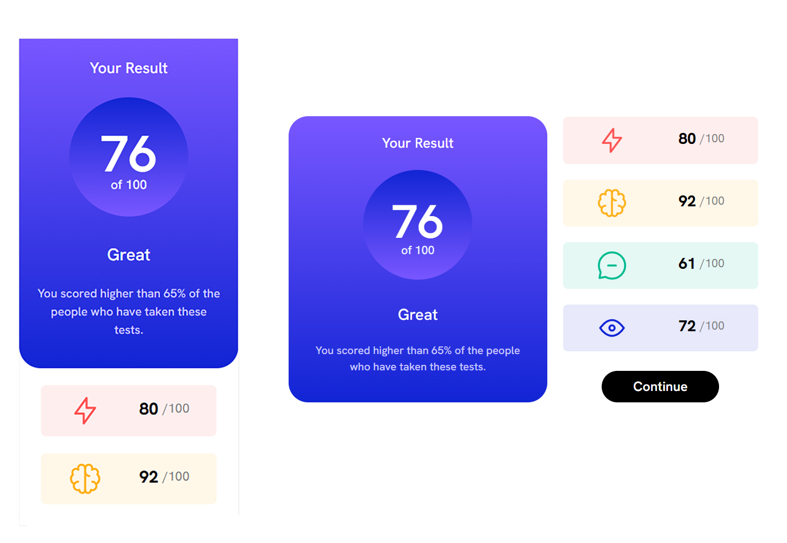

# Frontend Mentor - Results summary component


## Table of contents

- [Overview](#overview)
  - [Screenshot](#screenshot)
  - [Links](#links)
- [My process](#my-process)
  - [Built with](#built-with)
  - [What I learned](#what-i-learned)
  - [Continued development](#continued-development)
  - [Useful resources](#useful-resources)
- [Author](#author)
- [Acknowledgments](#acknowledgments)

**Note: Delete this note and update the table of contents based on what sections you keep.**

## Overview

### Screenshot



### Links

- Solution URL: (https://github.com/Junbol-Frontend-Mentor/results-summary-component)
- Live Site URL: (https://junbol-frontend-mentor.github.io/results-summary-component/)

## My process

### Built with

- Semantic HTML5 markup
- CSS custom properties
- Sass(SCSS)
- BEM (Block.Element.Modifier)
- Flexbox
- Mobile-first workflow
- GIT/GitHub
- PowerShell (CLI)

### What I learned

- creating all the logic in Javascript to do the creation of the data frames dynamically.
- Using forEach again to iterate on the buttons
- Using javascript to add the logic to make classes and elements to the DOM. for just a small project it was interested how I needed a bit of complex logic to resolve this because the combination of DOM , CSS classes manipulation and fetching a json data

```


```

### Continued development

I would like to continue studying responsive SCSS specially with Grid + Flexbox and CSS animation, transitions and FX like parallax.

### Useful resources

- [web.dev](https://web.dev/learn/css) - This helped me for get back on track with CSS.
- [w3schools](https://www.w3schools.com/css/default.asp) - The one place to refresh stuff in practical way.

## Author

- Website - [Junier Bolivar](https://www.bolivarcreativedesign.com)
- Frontend Mentor - [Junbol](https://www.frontendmentor.io/profile/Junbol)
- Twitter - [@JunierBolivar](https://www.twitter.com/@JunierBolivar)

## Acknowledgments
